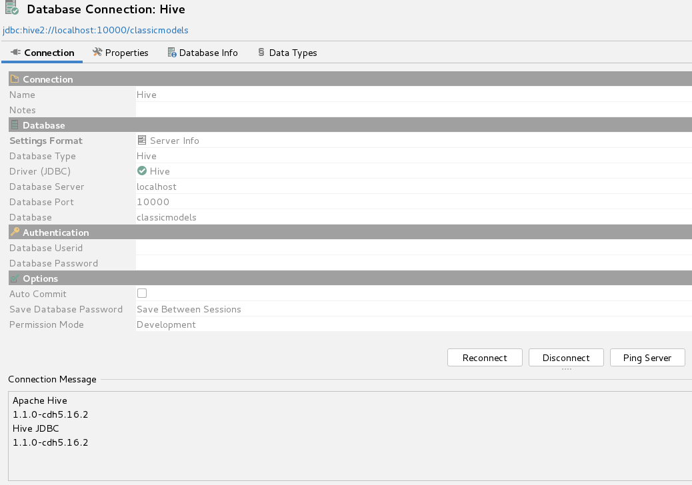
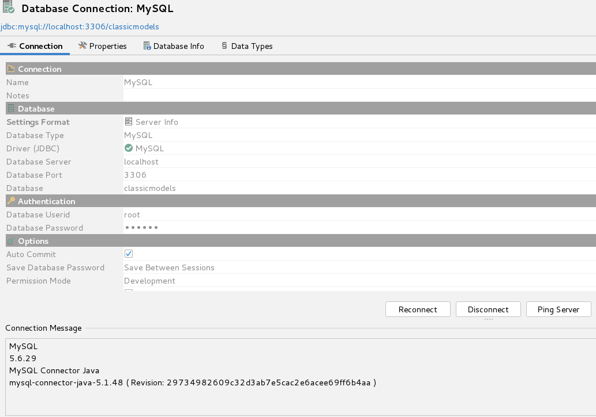
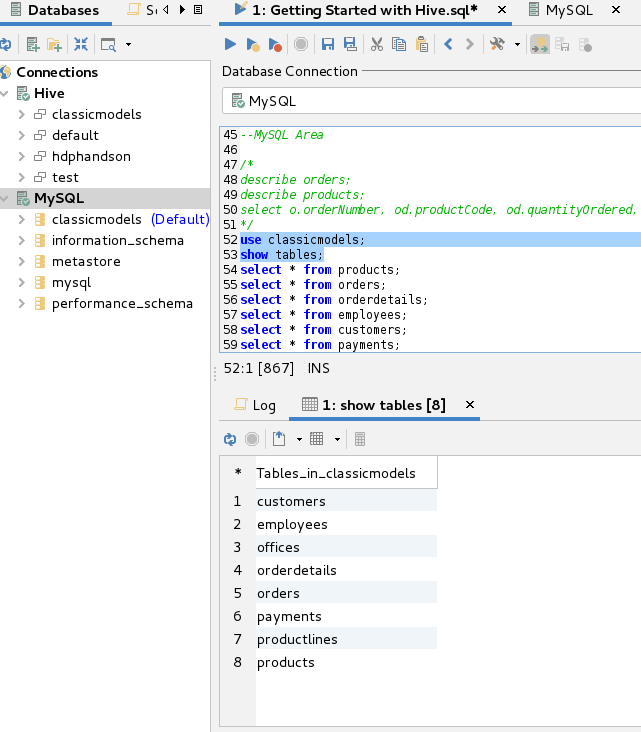
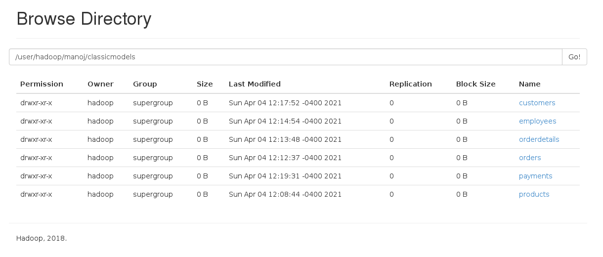
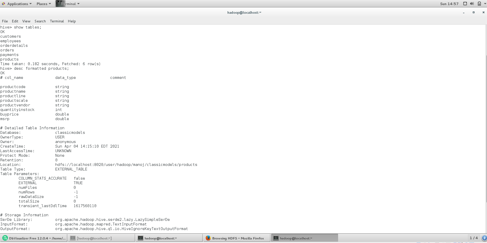
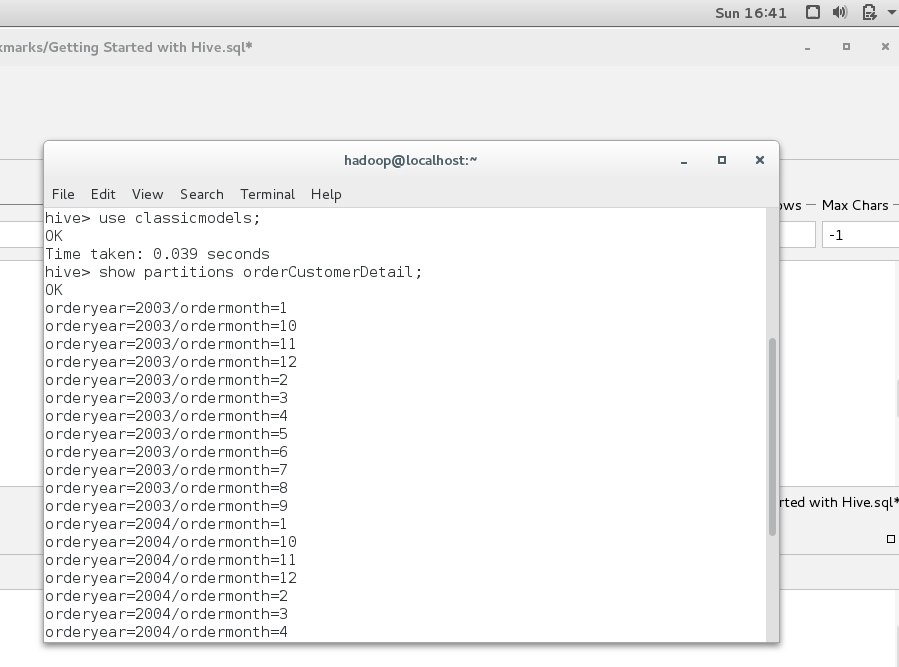

# Hadoop - Classic Models

## Step 1 : Classic models database loaded to MySQL by following command in mysql console:

    source /home/hadoop/Documents/classicModels.txt

Above file is present here [mysqlloadfile](inputfiles\mysqlsampledatabase.sql)

For running Queries in Hive and MySQL using DBVisualizer

### Connection Parameters for Hive:



### Connection Parameters for MySQL:



Checking tables in MySQL - Classicmodels DB:



## Step 2 : Loading from MySQL to HDFS:

**Products table**:

    sqoop import -Dorg.apache.sqoop.splitter.allow_text_splitter=true \
    --connect jdbc:mysql://localhost/classicmodels \
    --username root --password pass \
    --query 'SELECT productCode,productName,productLine,productScale,productVendor,quantityInstock,buyPrice,MSRP from products WHERE $CONDITIONS' \
    --target-dir '/user/hadoop/manoj/classicmodels/products' --m 2 \
    --fields-terminated-by '|' --delete-target-dir \
    --split-by productCode 

**Orders table**:

    sqoop import --connect jdbc:mysql://localhost/classicmodels \
    --username root --password pass \
    --table orders \
    --target-dir '/user/hadoop/manoj/classicmodels/orders' --m 2 \
    --fields-terminated-by '|' --delete-target-dir

**Orderdetails table**:

    sqoop import --connect jdbc:mysql://localhost/classicmodels \ 
    --username root --password hadoop \
    --table orderdetails \
    --target-dir '/user/hadoop/manoj/classicmodels/orderdetails' \
    --m 1 --fields-terminated-by '|' --delete-target-dir 

**Employees table**:

    sqoop import --connect jdbc:mysql://localhost/classicmodels 
    --username root --password hadoop \
    --table employees \
    --target-dir '/user/hadoop/manoj/classicmodels/employees' --m 1 \
    --fields-terminated-by '|' --delete-target-dir

**Customers table**:

    sqoop import --connect jdbc:mysql://localhost/classicmodels \
    --username root --password hadoop \
    --table customers \
    --target-dir '/user/hadoop/manoj/classicmodels/customers' --m 1 \
    --fields-terminated-by '|' --delete-target-dir 

**Payments table**:

    sqoop import --connect jdbc:mysql://localhost/classicmodels \
    --username root --password hadoop \
    --table payments \
    --target-dir '/user/hadoop/manoj/classicmodels/payments' --m 1 \
    --fields-terminated-by '|' --delete-target-dir

Classicmodels Database Unloaded to HDFS path /user/hadoop/manoj/classicmodels/



## Step3 : Creating Hive external tables 

Products:

    CREATE EXTERNAL TABLE products(
    productcode        string,
    productname        string,
    productline        string,
    productscale        string,
    productvendor        string,
    quantityinstock        int,
    buyprice        double,
    msrp        double)
    ROW FORMAT DELIMITED FIELDS TERMINATED BY '|'
    STORED AS TEXTFILE
    LOCATION '/user/hadoop/manoj/classicmodels/products';

Orders:

    CREATE EXTERNAL TABLE orders(
    ordernumber        int,
    orderdate        date,
    requireddate        date,
    shippeddate        date,
    status        string,
    comments        string,
    customernumber        int)
    ROW FORMAT DELIMITED FIELDS TERMINATED BY '|'
    STORED AS TEXTFILE
    LOCATION '/user/hadoop/manoj/classicmodels/orders';

OrderDetails:

    CREATE EXTERNAL TABLE orderdetails(
    ordernumber        int,
    productcode        string,
    quantityordered        int,
    priceeach        double,
    orderlinenumber        int)
    ROW FORMAT DELIMITED FIELDS TERMINATED BY '|'
    STORED AS TEXTFILE
    LOCATION '/user/hadoop/manoj/classicmodels/orderdetails';
 
Employees:

    CREATE EXTERNAL TABLE employees(
    employeenumber        int,
    lastname        string,
    firstname        string,
    extension        string,
    email        string,
    officecode        string,
    reportsto        int,
    jobtitle          string)
    ROW FORMAT DELIMITED FIELDS TERMINATED BY '|'
    STORED AS TEXTFILE
    LOCATION '/user/hadoop/manoj/classicmodels/employees';
 
Customers:

    CREATE EXTERNAL TABLE customers(
    customernumber        int,
    customername        string,
    contactlastname        string,
    contactfirstname        string,
    phone        string,
    addressline1        string,
    addressline2        string,
    city        string,
    state        string,
    postalcode        string,
    country        string,
    salesrepemployeenumber        int,
    creditlimit        double)
    ROW FORMAT DELIMITED FIELDS TERMINATED BY '|'
    STORED AS TEXTFILE
    LOCATION '/user/hadoop/manoj/classicmodels/customers';
 

Payments:

    CREATE EXTERNAL TABLE payments(
    customernumber        int,
    checknumber        string,
    paymentdate        date,
    amount        double)
    ROW FORMAT DELIMITED FIELDS TERMINATED BY '|'
    STORED AS TEXTFILE
    LOCATION '/user/hadoop/manoj/classicmodels/payments';


### External tables created in Hive:



## Step4 : Creating Hive Partitioned tables

orderCustomerDetail:
 
    Create table orderCustomerDetail(
    orderNumber int,
    orderDate timestamp,
    ShippedDate timestamp,
    customernumber int,
    customername string,
    orderAmount double,
    status string
    ) 
    partitioned by (orderYear int, orderMonth int) stored as Parquet;
    
    set hive.exec.dynamic.partition = true;
    set hive.exec.dynamic.partition.mode = nonstrict;
    
    insert into orderCustomerDetail partition (orderYear, orderMonth) 
    select o.orderNumber, o.orderdate, o.shippeddate, c.customernumber, c.customername, cast(od.quantityordered * od.priceeach as decimal(12,2)), o.status, year(orderDate), month (orderDate) 
    from orders o 
    join orderdetails od on (o.orderNumber = od.orderNumber)
    join customers c on o.customernumber = c.customernumber; 

Partitions:



orderProductDetail:
 
    Create table orderProductDetail(
    orderNumber int,
    orderDate timestamp,
    productCode string,
    productName string,
    productLine string,
    orderAmount double
    ) 
    partitioned by (orderYear int, orderMonth int) stored as Parquet;
    
    set hive.exec.dynamic.partition = true;
    set hive.exec.dynamic.partition.mode = nonstrict;
    
    insert into orderProductDetail partition (orderYear, orderMonth) 
    select o.orderNumber, o.orderDate, od.productCode, p.productname, p.productline, cast(od.quantityordered * od.priceeach as decimal(12,2)), year(orderDate), month (orderDate) 
    from orders o 
    join orderdetails od on (o.orderNumber = od.orderNumber)
    join products p on od.productcode = p.productcode;

Step 5 : Execute Queries
1.	Find the total sales generated by sales representatives by month
Target TableName: SalesSummary
Output should have following columns:
Sales Rep Code, Sales Rep Name, Year, month, Sales

```
select e.employeenumber, concat_ws(' ', e.firstname,e.lastname)  employeeName,o.orderyear, o.ordermonth, cast(sum(orderamount) as decimal(14,2)) sales 
from orderCustomerDetail o
join customers c on o.customernumber = c.customernumber
join employees e on c.salesrepemployeenumber = e.employeenumber
group by e.employeenumber, o.orderyear, o.ordermonth, concat_ws(' ', e.firstname,e.lastname)
;
```

 
Result file: [Total Sales by Employee](outfiles/Total_Sales_by_Employee.xlsx)


2.	Find the total sales generated by each product by month
Target TableName: ProductSummary
Output should have following columns:
Product Code, Product Name, Product Line, year, month, sales

```
select productcode, productname, productline, orderyear, ordermonth, cast(sum(orderamount) as decimal(14,2)) sales 
from orderProductDetail 
group by productcode, orderyear, ordermonth, productname, productline
;
```

Result file: [Total Sales by Product](outfiles/Total_Sales_by_Product.xlsx)

3.	Find the total order amount, and payment amount for each customer by joining OrderCustomerDetail and Payments tables
Target TableName: CustomerSummary
Output should have following columns:
CustomerNumber, CustomerName, OrderAmount, PaymentAmount

```
select opd.customernumber, opd.customername, cast(sum(opd.orderamount) as decimal(14,2)) totalOrderAmount , pay.paymentAmount
from orderCustomerDetail opd
join (select customernumber,cast(sum(amount) as decimal(14,2)) as paymentAmount from payments group by customernumber) pay
on opd.customernumber = pay.customernumber
group by opd.customernumber, opd.customername, pay.paymentAmount
;
```

Result file: [Customer_OrderAmount_PaidAmount.](outfiles/Customer_OrderAmount_PaidAmount.xlsx)


## Other commands:
 
### Get the unloaded data from HDFS to Local
    hdfs dfs -get /user/hadoop/manoj/classicmodels/ .
 
### Load to Hive
    LOAD DATA LOCAL INPATH 'home/manoj/classicmodels/orders' OVERWRITE into table orders;
 
### MySQL to Hive Directly
    sqoop import --connect jdbc:mysql://localhost/classicmodels \
    --username root -P \
    --table products \
    --hive-import \
    --hive-table classicmodels.products -m 1 \
    --fields-terminated-by '|'
    
    sqoop import --connect jdbc:mysql://localhost/classicmodels \
    --username root -P \
    --table orders \
    --hive-import \
    --hive-table classicmodels.orders -m 1 \
    --fields-terminated-by '|'
    
    sqoop import --connect jdbc:mysql://localhost/classicmodels \
    --username root -P \
    --table orderdetails \
    --hive-import \
    --hive-table classicmodels.orderdetails -m 1 \
    --fields-terminated-by '|'
    
    sqoop import --connect jdbc:mysql://localhost/classicmodels \
    --username root -P \
    --table employees \
    --hive-import \
    --hive-table classicmodels.employees -m 1 \
    --fields-terminated-by '|'
    
    sqoop import --connect jdbc:mysql://localhost/classicmodels \
    --username root -P \
    --table customers \
    --hive-import \
    --hive-table classicmodels.customers -m 1 \
    --fields-terminated-by '|'
    
    
    sqoop import --connect jdbc:mysql://localhost/classicmodels \
    --username root -P \
    --table payments \
    --hive-import \
    --hive-table classicmodels.payments -m 1 \
    --fields-terminated-by '|'


